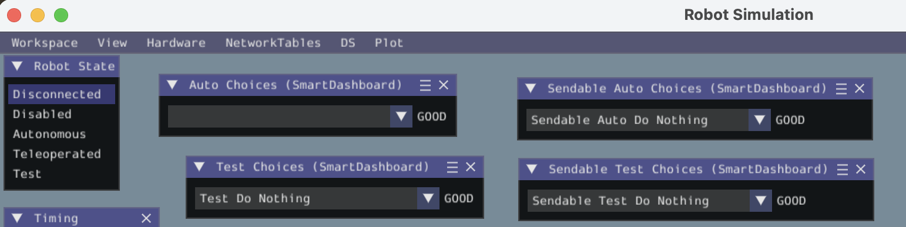

# bug report LoggedDashboardChooser

For debugging purposes, this code makes 4 choosers
- `self.autoChooser: LoggedDashboardChooser[Command] = LoggedDashboardChooser(...`
- `self.autoSendableChooser = SendableChooser()`
- `self.testChooser: LoggedDashboardChooser[Command] = LoggedDashboardChooser(...`
- `self.testSendableChooser = SendableChooser()`

When running the code it seems like a bug. The menu items for self.autoChooser are
placed in the self.testChooser. But the self.autoSendableChooser and 
self.testSendableChooser
are each able to maintain independent lists of options.

To run this code:
- clone this repo
- checkout this commit

```
uv sync
uv run -- robotpy sync
uv run -- robotpy sim
```

Then look at the simulation window(s) for:
- Simulation Window Menu Bar -> NetworkTables -> SmartDashboard -> 
  - "Auto Choices"
  - "Test Choices"
  - "Sendable Auto Choices"
  - "Sendable Test Choices"

When developing the code for this bug report, the "Auto Choices" SmartDashboard menu item
existed in the simulation window once and remained an option.  But when starting with
an empty repo, the "Auto Choices" menu item does not appear.

An example of the bug with "Auto Choice" menu item appearing:

